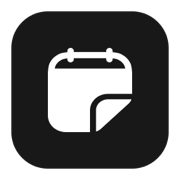
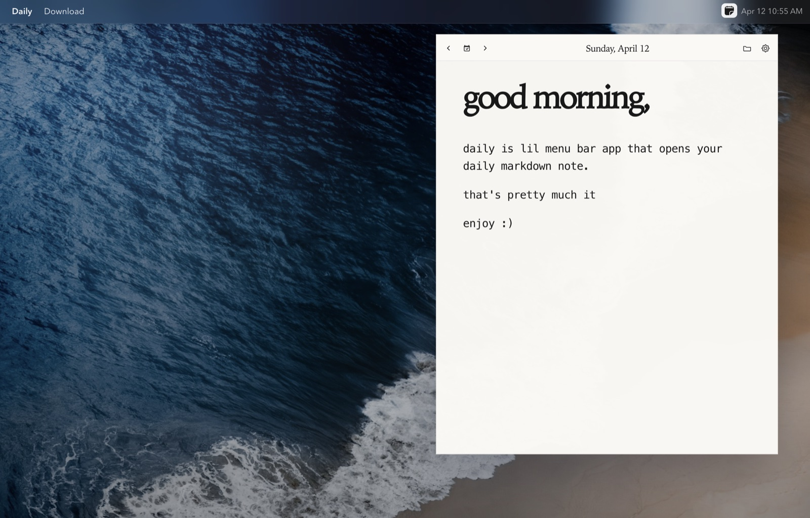

  

<h1 align="center">Daily</h1>

  A tiny menubar notebook.
   
  One plain Markdown file per day, stored in folders you choose.

  <strong>Beta:</strong> Daily is beta software and might contain bugs. If you run into anything, please DM me on Twitter
  <a href="https://x.com/razberrychai">@razberrychai</a>.

  <a href="https://github.com/hellorashid/daily/releases/latest">Download</a>

  

## What it does

- Lives in your menubar and opens as a compact panel.
- Each day is a `YYYY-MM-DD.md` file.
- Notes autosave while you type.
- Add multiple notebook folders and switch between them.
- Navigate by arrows or calendar (with indicators for days that already have a note).
- Open the current file in your default editor, reveal it in your file manager, or copy the contents.

## Markdown

Daily is preview-first, but it is still just Markdown underneath.

- Task lists: `- [ ]` and `- [x]` (click to toggle)
- Dividers: `---`

## Privacy

Your notes are normal files on disk. Daily doesn’t sync anything by itself.
